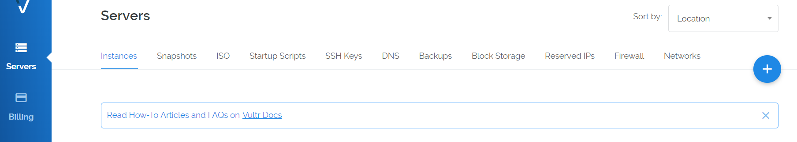
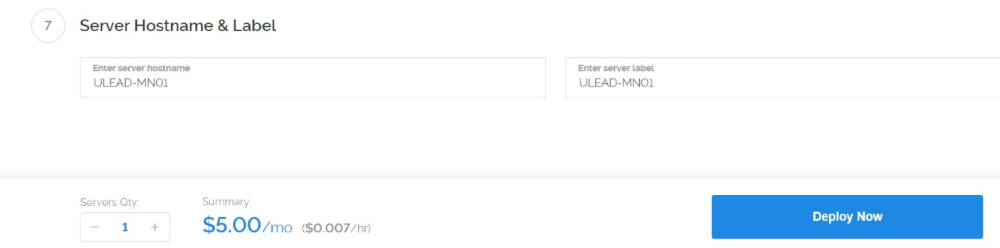
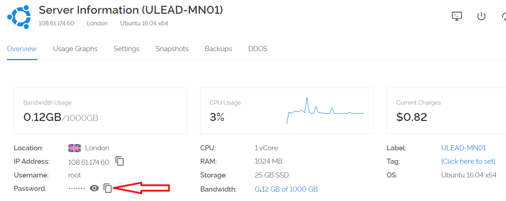
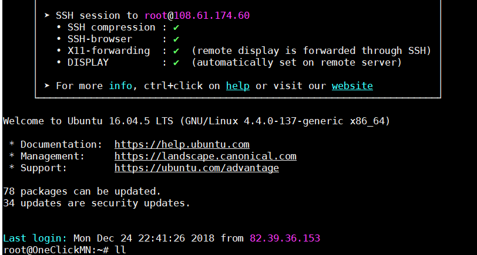
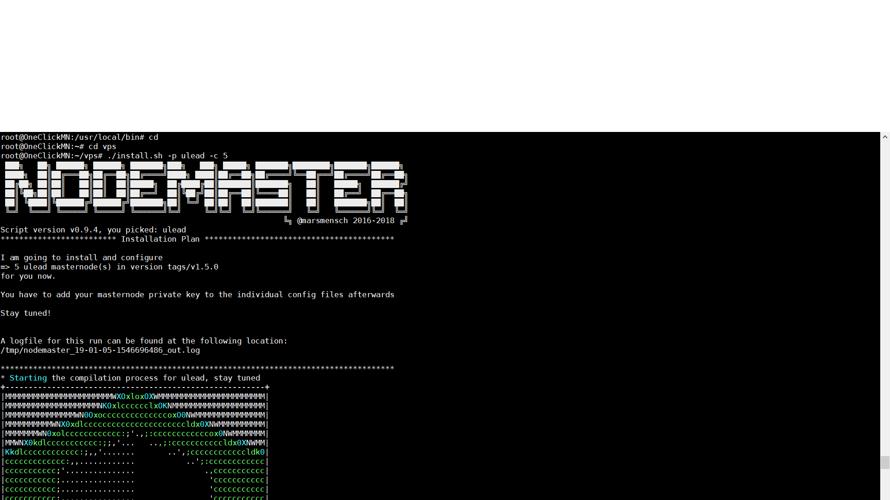
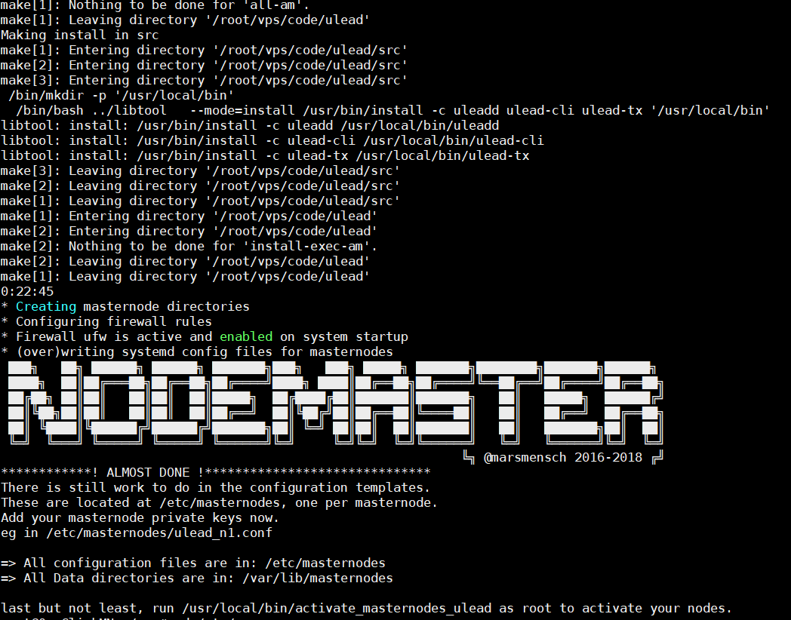
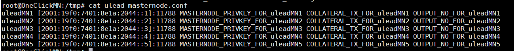
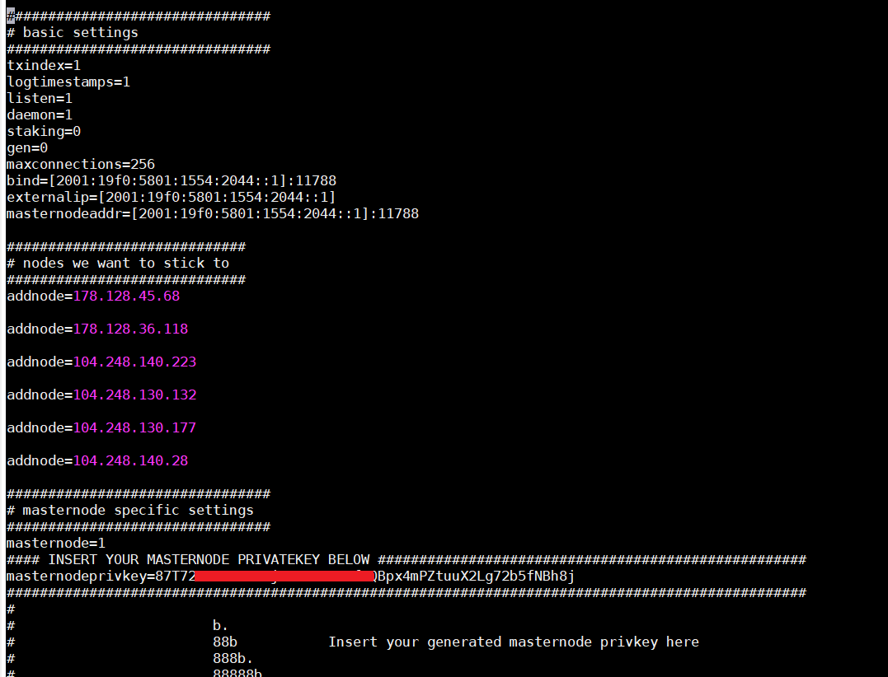

# ULEAD One-Click Masternode VPS Installation

This project is a handy bash script to setup number of ulead masternodes at a time just on one VPS of type ipv6. Almost all of the steps are automated and no manual intervention is required during this process. You can use this script to setup either single masternode or multiple master nodes. Based on the 'number' passed as parameter in the initial step of process, master nodes are set up.


This masternode installation script vastly simplifies the setup of a ULEAD masternode running on a virtual private server (VPS), and it also adds a number of other powerful features, including:

* IPv6 Support
* Installs 1-100 (or more!) ULEAD masternodes in parallel on one VPS, with individual ulead.conf and data directories
* It can install masternodes for other coins on the same VPS as ULEAD
* 100% auto-compilation and 99% of configuration on the masternode side of things
* Automatically compiling from the latest ULEAD release tag, or another tag can be specified
* Automatic startup for all masternode daemons

Some notes and requirements:

* Script has only been tested on a Vultr VPS, but should work almost anywhere where IPv6 addresses are available
* Currently only Ubunto 16.04 Linux is supported
* This script needs to run as root or with sudo, the masternodes will and should not!

## How to get VPS server

For new masternode owners, **Vultr** is recommended as a VPS hosting provider, but other providers that allow direct root SSH login access and offer Ubunto 16.04 may work.

You can use the following referral link to sign up with Vultr for VPS hosting:

<a href="https://www.vultr.com/?ref=7302091"></a>

## Get a VPS system for your masternode(s)

I will use vultr for my instructions, but in practice and with a bit of tuning any hoster that gives you multiple free IPv6 addresses. Register / login with vultr.

Feel free to use our reflink to signup and receive a bonus w/ vultr:
<a href="https://www.vultr.com/?ref=7302091"></a>

First, create a new VPS by clicking that small "+" button.



## Location choice

The location doesn't matter too much. If in doubt, choose a location next to you.


## Linux distribution (Ubuntu 16.04 LTS)

Select Ubuntu 16.04, i am mostly testing for that version.


## VPS size

A decent masternode needs a bit of RAM and some storage space. The $5 instance is good enough for up to 5 masternodes. I recommend not running more than 3 production masternodes in parallel, since block rewards suffer from instability (eg when your nodes go down every couple of hours).


## Activating additional features (IPv6)

Multiple masternodes on one VPS require multiple IPv6 addresses. Toggle "Enable IPv6" to activate that feature for free (Vultr).


## Hostnames & number of VPS

Choose how many instances you want and click "Deploy Now".



## Accessing your VPS via SSH

Copy access credentials for SSH access by opening the server details.



## First SSH session

Login to your newly installed node as "root".



## Masternode script installation

Clone this git repository first:

```
git clone https://github.com/uleadapp/vps.git && cd vps
```


## Install the desired masternode and amount

Use the *./install.sh* script with the desired crypto and masternode count as parameters, e.g. to install 5 ULEAD masternodes:

```
./install.sh -p ulead -c 5
```

The script downloads, compiles and configures the system now. This will usually take between 20-25 minutes.



The *./install.sh* script outputs a list of possible parameters if executed without options.

## End of installation

The script will output lots of boring stuff and it's ascii banner when done. Your only real work begins now.




## Masternode configuration files

The generated configuration files are located at /etc/masternodes/. One file per masternode and crypto.




## Insert your masternode private key

In 99% you can use the generated settings as is. The only value you MUST change is the masternode private key, generated in your controller wallet. Contact the individual crypto community if unsure, although the steps are identical for most master node coins.




## Start your new masternodes

A script to enable masternode start at boot has been created at */usr/local/bin/activate_masternodes_ulead.sh* for your convenience. There is exactly one script per installed masternode crypto.

Run it after you finished configuration, e.g. after a ulead installation do.

```
/usr/local/bin/activate_masternodes_ulead
```     

## Last step, the controller

To activate the new nodes in your _local_ (not the VPS) controller wallet, add the bind address entries with port to a file called "masternode.conf" as usual.

     uleadMN1 [2001:19f0:7401:8e1a:2044::1]:11788 KEY TX OUTPUT
     uleadMN2 [2001:19f0:7401:8e1a:2044::2]:11788 KEY TX OUTPUT
     uleadMN3 [2001:19f0:7401:8e1a:2044::3]:11788 KEY TX OUTPUT
     uleadMN4 [2001:19f0:7401:8e1a:2044::4]:11788 KEY TX OUTPUT
     uleadMN5 [2001:19f0:7401:8e1a:2044::5]:11788 KEY TX OUTPUT
     
To make this a bit easier for large installations, i implemented a small gimmick in the newest version. Now after the script has run, a partial of the "masternode.conf" file is generated and placed on the VPS eg for XIOS at "/tmp/ulead_masternode.conf"

So you can take the contents from there and paste it into your local controller-wallets masternode.conf all that you need to add is the relevant pieces from "masternode outputs"


You get the idea, another step to a fully automated setup... ;-)

## Troubleshooting the masternode on the VPS

If you want to check the status of your masternode, the best way is currently running the cli e.g. via

```
 /usr/local/bin/ulead-cli -conf=/etc/masternodes/ulead_n1.conf getinfo

{
  "version": 1050000,
  "protocolversion": 70005,
  "walletversion": 61000,
  "balance": 0.00000000,
  "zerocoinbalance": 0.00000000,
  "blocks": 20127,
  "timeoffset": 0,
  "connections": 23,
  "proxy": "",
  "difficulty": 25214301.94376921,
  "testnet": false,
  "moneysupply": 2557535582.83194416,
  "zULEADsupply": {
    "1": 0.00000000,
    "5": 0.00000000,
    "10": 0.00000000,
    "50": 0.00000000,
    "100": 0.00000000,
    "500": 0.00000000,
    "1000": 0.00000000,
    "5000": 0.00000000,
    "total": 0.00000000
  },
  "keypoololdest": 1545510413,
  "keypoolsize": 1001,
  "paytxfee": 0.00000000,
  "relayfee": 0.00010000,
  "staking status": "Staking Not Active",
  "errors": ""
}
```

This project was forked from Phore project. Phore was forked from https://github.com/masternodes/vps. @marsmensch (Florian) is the primary author behind this VPS installation script for masternodes. If you would like to donate to him, you can use the BTC address below

**Have fun, this is crypto after all!**

```
BTC  33ENWZ9RCYBG7nv6ac8KxBUSuQX64Hx3x3
```
# Issues and Questions
Please join our Discord channel for any queries:
https://discord.gg/drPE7v

**Have fun, ULEADer!**
